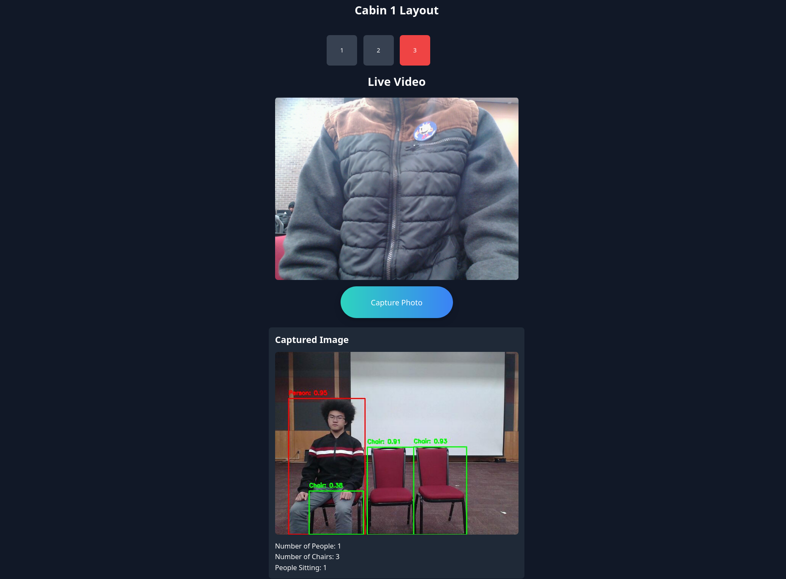

# NJ TRANSIT SEAT TRACKER

This app allows vehicle drivers to monitor the seat locations of passengers using computer vision.

To run this app, run:

python manage.py runserver (backend directory)

npm run dev (frontend directory)

This app was made in 16 hours for Hack RU 2024

