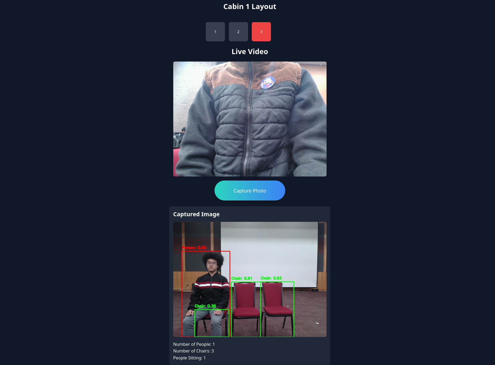

# NJ TRANSIT SEAT TRACKER

This app allows vehicle drivers to monitor the seat locations of passengers using computer vision.

This app was made in 16 hours for Hack RU 2024, winning 2nd place in the transit track.

 

We then briefly collaborated with members of the NJ Transit Department of Innovation after the hackathon, but have continued to fine tune and improve the software independently since then! 

## Prerequisites

- Python 3.10+
- Node.js 18+
- PostgreSQL

## Installation

```bash
git clone https://github.com/zClerigo/nj-track.git
```

### Backend Setup:

```bash
cd backend
python -m venv venv
source venv/bin/activate  # Windows: venv\Scripts\activate
pip install -r requirements.txt
cp .env.example .env      # Edit with your DB credentials
python manage.py migrate
python manage.py runserver
```
Edit the .env file with your credentials (you will have to make a NJTransit Developer's account to get the software working). For the token part, you don't have change anything, just include your NJTransit Developer username and password. 
### Frontend Setup:

```bash
cd frontend
npm install
cp .env.example .env      # Edit with your API URL if needed
npm run dev
```
Toggle DEVMODE environment variable to "development" use stored developer images for testing or "production" to use the users capture images.  

## Running The App

```bash
cd backend
python manage.py runserver #(backend directory)
```

On a separate terminal:

```bash
cd frontend
npm run dev (frontend directory)
```


